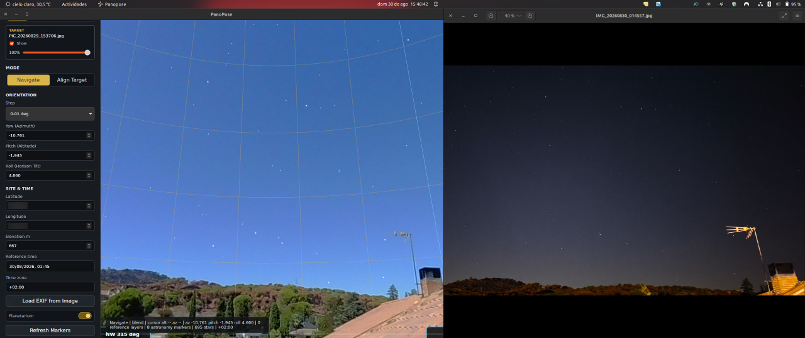

# PanoPose

PanoPose is a Linux desktop application for manually orienting, registering, inspecting, and exporting full-sphere equirectangular panoramas for astronomical observing-site planning. It helps align horizon features, Alt/Az grids, astronomy markers, and night-sky references so a panorama can be calibrated for planning observations.



The source of truth for the original product direction is [docs/BLUEPRINT.md](docs/BLUEPRINT.md).

## Current Features

- Load a target 2:1 equirectangular panorama and view it inside a zoomable Three.js sphere.
- Navigate the view independently from panorama alignment.
- Align the target panorama with yaw/azimuth, pitch/altitude, and roll/horizon-tilt controls.
- Add calibrated reference panoramas as layers.
- Compare layers using blend, target-only, reference-only, and blink modes.
- Display an Alt/Az grid with zoom-dependent spacing and cardinal labels.
- Read EXIF/XMP metadata from panoramas, including capture time, timezone offset, GPS position, elevation, and PanoPose/GPano pose metadata.
- Load time and/or site metadata from an ordinary image without loading it as a panorama layer.
- Save PanoPose orientation, panorama capture time, site, and GPano metadata back into an image using `exiftool`.
- Export the oriented target as a PNG 2:1 equirectangular panorama at the original target resolution.
- Export with South on the horizontal centerline, North at the left/right seam, and the horizon vertically centered.
- Show overwrite confirmation and a row-based progress bar during long exports.
- Toggle automatic sky removal and preview the target panorama with the connected sky region transparent.
- Export PNG panoramas with sky removed to alpha when `Remove Sky` is enabled.
- Display Sun, Moon, planet, and bright-star markers as open circles with labels below them.
- Enable Planetarium mode to show the 1500 brightest catalog stars above the horizon for the selected site and time.
- Automatically enable Planetarium mode when EXIF-imported time places the Sun below the horizon.
- Remember the last image directory within the current app session for image-open dialogs.
- Build desktop packages with the bundled 512x512 application icon configured for Tauri release artifacts.

## Main Workflow

1. Open a target equirectangular panorama.
2. Confirm or import the site and reference time.
3. Use the Alt/Az grid, astronomy markers, Planetarium mode, or a calibrated reference panorama as fixed references.
4. Switch to `Align Target` and adjust yaw, pitch, and roll until the panorama agrees with those references.
5. Use `Save As` to write orientation/time/site metadata into an image, or use `Export Pano As` to generate a calibrated PNG panorama.

For ordinary phone photos, PanoPose intentionally imports only EXIF time/site metadata. It does not attempt to project normal rectilinear photos onto the sphere, because reliable FOV estimation is usually unavailable from phone EXIF alone.

`Load EXIF from Image` updates the astronomical reference time, not the target panorama capture time. To deliberately replace the capture timestamp that `Save As` writes to EXIF, edit `Panorama capture time` or use `Use Reference Time`.

## Export Behavior

`Export Pano As` writes a derived PNG file and does not modify the source panorama.

- The export keeps the target panorama's original pixel dimensions.
- The output is a full-sphere 2:1 equirectangular image covering 360° azimuth by 180° altitude.
- South, azimuth 180°, is centered horizontally.
- The geometric horizon is centered vertically.
- The save dialog only offers PNG output; if the selected name has no `.png` suffix, PanoPose appends one.
- Existing output files require explicit overwrite confirmation.
- Long exports show a modal progress bar based on completed output rows.
- When `Remove Sky` is enabled, export detects a full-resolution source-space sky mask before resampling and writes sky pixels as transparent alpha.

## Sky Removal

`Remove Sky` is an automatic, non-destructive mask preview for the target panorama.

- Detection starts from the connected top/zenith sky region, including across the equirectangular left/right seam.
- Blue sky and bright low-saturation sky are treated as removable candidates.
- Sun, Moon, and clouds connected to the sky region are removed with the sky.
- Disconnected blue or white foreground objects are intended to stay opaque.
- The `Sky sensitivity` slider controls how broadly the detector accepts sky-colored pixels; values below zero are extra strict for ambiguous blue or pale ground.
- Toggling `Remove Sky` off and back on reuses the cached preview while the target image, alignment angles, and sky sensitivity are unchanged.

## Versioning

PanoPose displays application versions with a `v` prefix.

- Odd minor versions are development lines. The built app derives the patch number from the Git commit count, so a `0.1.0` manifest build at commit count 12 displays `v0.1.12`.
- Even minor versions are release lines. Automation leaves them fixed, so `1.2.0` displays `v1.2`, and `1.2.1` is shown only after an explicit manifest bump.
- If Git metadata is unavailable on an odd-minor build, the app falls back to the manifest patch version.

## Repository Layout

- `crates/panopose-core`: reusable Rust model, coordinate math, panorama export with optional progress reporting, sky-mask detection, synthetic test assets, and astronomy provider boundary.
- `crates/panopose-cli`: developer CLI for generating validation panoramas and exercising core workflows.
- `src-tauri`: Tauri v2 desktop shell and Rust commands, including metadata writing and blocking-thread image export with progress events.
- `frontend`: Vite + TypeScript + Three.js viewer.

## Development

### Release Quickstart

For a current-platform release build and optional install:

```sh
./quickstart-panopose.sh
```

The quickstart script:

- checks for Rust, Node.js, and npm;
- offers to install `cargo-tauri` if it is missing;
- installs frontend dependencies with `npm ci --prefix frontend`;
- asks which final packages to build, or accepts explicit `--bundles` / `--no-bundle` options;
- builds the release app with `cargo tauri build --ci`;
- lists generated bundle artifacts and the release executable path;
- offers to install the preferred generated package.

Useful options:

```sh
./quickstart-panopose.sh --skip-app-install
./quickstart-panopose.sh --no-install
./quickstart-panopose.sh --yes
./quickstart-panopose.sh --bundles deb,rpm
./quickstart-panopose.sh --no-bundle
```

On Linux, the package prompt accepts `deb`, `rpm`, `appimage`, comma-separated combinations such as `deb,rpm`, `all`, or `none`. The default prefers `.deb` when `dpkg` is available, then `.rpm` when `rpm` is available, then `.AppImage`.

If app installation is skipped or declined, the script prints the absolute path to the release executable and any final package files that were requested and produced. When installing, the installer prefers a generated `.deb` when `dpkg` is available, then `.rpm` when `rpm` is available, then `.AppImage`. AppImage installation copies the file to `~/.local/bin/panopose.AppImage` and creates a desktop entry under `~/.local/share/applications`.

The Tauri bundle config uses `src-tauri/icons/icon.png` as the release icon. The icon must remain a square RGBA PNG; the current asset is 512x512.

AppImage bundling is handled by Tauri's linuxdeploy tooling. On systems without working AppImage/FUSE support, `.deb` and `.rpm` artifacts may still be produced even when AppImage packaging fails.

### Local Development

```sh
cargo test --workspace
npm install --prefix frontend
npm run dev --prefix frontend
```

To run the desktop app after installing frontend dependencies:

```sh
cargo tauri dev
```

`Save As` metadata writing requires `exiftool` to be installed and available on `PATH`. It writes EXIF capture-time tags from `Panorama capture time`, while the separate astronomical reference time is stored in PanoPose XMP metadata. PNG panorama export uses the Rust `image` backend and does not require `exiftool`.

## Data Sources

- `crates/panopose-core/data/bright_stars_1500.csv` is a generated subset of the Yale Bright Star Catalog / NASA HEASARC Bright Star Catalog, limited to the 1500 brightest valid entries by visual magnitude.
- Planetarium mode is offline after build because the star subset is bundled into `panopose-core`.
